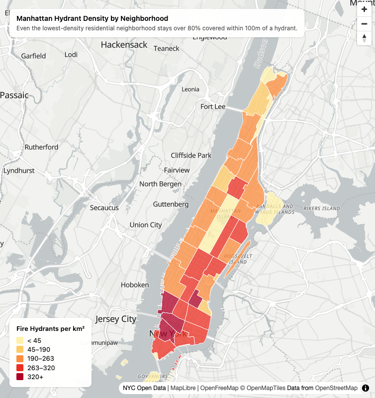

# Manhattan Hydrant Density Map

🗺️ **[Live map](https://adamgoodell.github.io/nyc-hydrant-map/)**

An interactive web map of fire hydrant density across Manhattan neighborhoods.
Built on the modern open-source stack (MapLibre + PMTiles + GitHub Pages)
for $0/month, no server required.



## The question

Where is hydrant coverage densest in Manhattan, and which neighborhoods
are underserved relative to their area?

## The data

- NYC Neighborhoods (NTAs): 38 Manhattan NTAs, including parks and other
  non-residential land (Source: NYC Open Data, 2020 Neighborhood
  Tabulation Areas)
- NYC Fire Hydrants: 109,725 points citywide, joined and aggregated to
  neighborhood level in [PP2](https://github.com/adamgoodell/nyc-hydrant-analysis)
- Density and coverage were computed in PP2 using PostGIS and GeoPandas;
  this map visualizes that output directly (`hydrant_density.parquet`)

## The technology choices

- **MapLibre GL JS** for rendering. Open-source fork of Mapbox GL JS, same
  API, no token or usage tier.
- **PMTiles** for the data layer. A single file containing the tiled map,
  streamed via HTTP range requests. No tile server, hosted alongside
  `index.html`.
- **tippecanoe** for tile generation (`convert.sh`). Polygon recipe with
  `--detect-shared-borders` for clean rendering at shared NTA boundaries.
- **GitHub Pages** for hosting. Free, global CDN, automatic HTTPS.

Total monthly cost: $0. Total servers running: 0.

## How to reproduce

```bash
git clone https://github.com/adamgoodell/nyc-hydrant-map.git
cd nyc-hydrant-map

python3 -m venv .venv
source .venv/bin/activate
pip install geopandas pyarrow

python3 scripts/parquet_to_geojson.py   # parquet -> data/raw/*.geojson
./convert.sh                             # geojson -> hydrant_density.pmtiles

npx http-server -p 8000 --cors           # local test (python3 -m http.server
                                          # does NOT support the HTTP range
                                          # requests PMTiles needs)
# then open http://localhost:8000
```

## What I learned

Deciding on what the map should actually say took the most iterations. Everything else depended on that (breakpoints/bands, titles, labels). The choropleth color can only encode one variable, but the real finding was about two: density and coverage don't move together, so low density doesn't mean underserved. I could have added a second layer or a toggle to show both, but that adds complexity for a general audience to parse. I kept one simple layer instead and used the title to carry the second finding in words.

## Stack

- MapLibre GL JS 4.5.2
- PMTiles 3.2.0
- tippecanoe 2.79.0
- GitHub Pages
